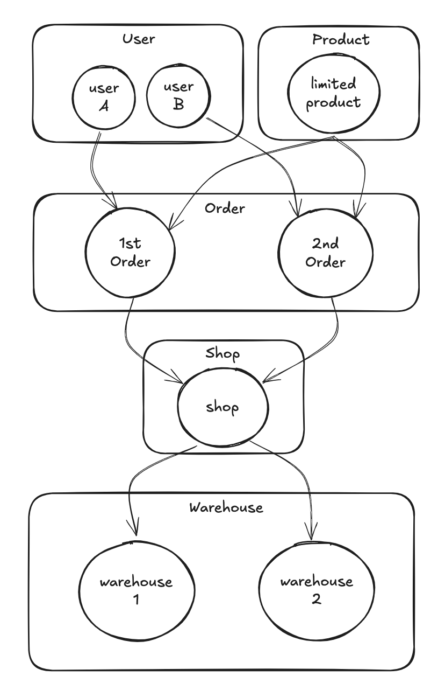

# POC Development

Here are some quick notes about how we create the services to overcome our problems.

### User Service:
- **Authentication**: Users can log in using a phone or email.

### Product Service:
- **List Products**: Users can view a list of products and their stock availability.

### Order Service:
- **Checkout and Stock Deduction**: When a customer orders, the system reserves (locks) the stock of the ordered products. If another customer attempts to order the same product, the system checks the available stock and deducts the reserved quantity. This prevents overselling.
- **Release Stock**: Reserved stock is released if payment is not made within a specified time frame (N minutes). This is handled using a background job or a timer.

### Shop Service:
- **Warehouse Management**: The shop has one or more warehouses.

### Warehouse Service:
- **Stock Management**: Track and manage stock levels for each warehouse.

### Common Considerations:
- **Database**: Store product information, order details, stock levels, and warehouse data in a suitable database system.
- **Concurrency and Locking**: Implement mechanisms to handle multiple users accessing and modifying stock levels simultaneously.
- **Monitoring and Logging**: Track system activities and errors using monitoring and logging tools.
- **Error Handling**: Implement robust error handling to gracefully handle failures and exceptions.
- **Testing**: Develop comprehensive unit, integration, and end-to-end tests to ensure service reliability.
- **Scaling**: Consider how your system can scale horizontally to handle increased traffic and data volumes.
- **Deployment and Containerization**: Decide on deployment methods (containers, virtual machines) and management tools (container orchestration).
